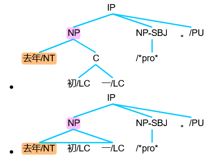

# TreeBank显示js插件

用于显示语法树的一个js小插件。

## 特性

* 支持中/英文节点
* 可交互式折叠/展开子树，也支持初始折叠子树
* json格式数据接口
* 仅依赖two.js和jQuery(只使用了$.parseJSON()方法，可用其它json解析方法替换)

```javascript
//可按需设置字体、大小、行高等。若采用默认，则这三个变量可不设置
var FONT_STYLE = {
    family:'"Arial","Microsoft YaHei","黑体","宋体",sans-serif',    // font style
    baseline: 'bottom',
    alignment:'left',
    size: 13,           //font size
    leading: 13         //line height
}
var TREE_LAYER_HEIGHT = 40  // the height of tree layer by layer
var TREE_LEAF_GAP = 15      // the gap between a leaf to another

var tree_json = '{"label":"IP", "children":[{"label":"NP", "children":["去年/NT", {"label":"C", "children":["初/LC","一/LC"] }] },{"label":"NP-SBJ", "children":["/*pro*"] },"。/PU"] }';
drawTree('l0',tree_json);   // l0 为加入的document Element对象id。例如 <li id='l0'></li>
var tree_json = '{"label":"IP", "children":[{"label":"NP", "fold":"true", "children":["去年/NT", {"label":"C", "children":["初/LC","一/LC"] }] },{"label":"NP-SBJ", "children":["/*pro*"] },"。/PU"] }';    //注意：fold==true 初始为折叠子树状态
drawTree('l1',tree_json);
```



